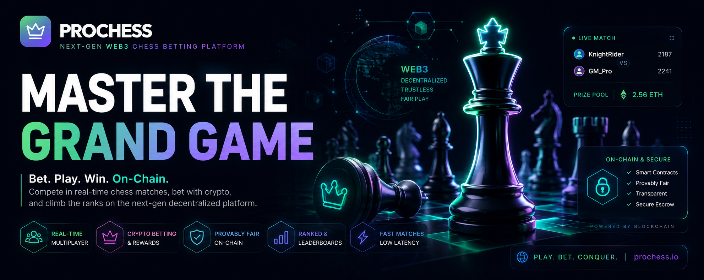
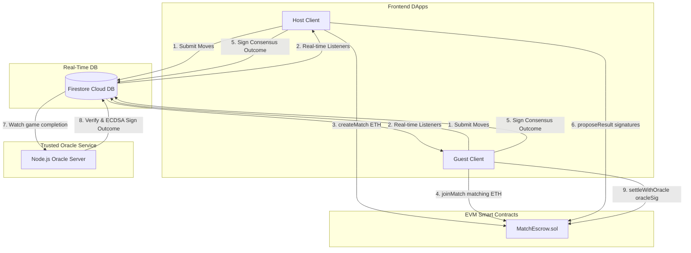
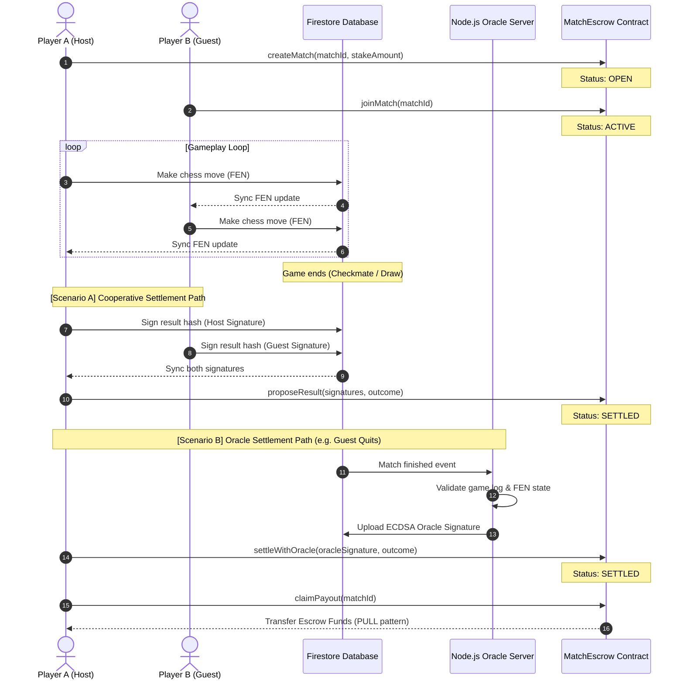
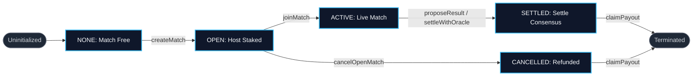

[](https://opensource.org/licenses/MIT)
[](https://soliditylang.org/)
[](https://react.dev/)
[](https://firebase.google.com/)
[](https://hardhat.org/)
[](https://vitejs.dev/)

PROCHESS is a hybrid Web2/Web3 multiplayer chess platform. It utilizes serverless architecture (**Vite + React + Firebase Firestore**) for low-latency gameplay and combines it with **Ethereum/EVM Smart Contracts** (`MatchEscrow.sol`) for trustless wagers, cooperative settlements, and automated off-chain Oracle fallback validation.

---

## 🏗️ System Architecture

PROCHESS operates on a hybrid architecture to balance Web2's performance (instant move synchronization) with Web3's decentralization (non-custodial funds management):



---

## 🔄 End-to-End Match Lifecycle & Settlement Sequence

The lifecycle of a wager match follows a strict state transition model. If both players behave honestly, they sign the result cooperatively. If a dispute or disconnect occurs, the off-chain Oracle resolves the escrow unilaterally:



---

## ⚙️ Smart Contract State Machine

The `MatchEscrow.sol` contract enforces strict status-changing rules. Only specific functions can progress the contract to subsequent states:



---

## 📊 Data & API Contracts

### 1. Firestore Schema (`/rooms/{roomId}`)
The real-time database schema aligns player metadata, FEN progress logs, and cryptographic consensus parameters:

| Field | Type | Description |
| :--- | :--- | :--- |
| `fen` | `string` | The current board state in Forsyth-Edwards Notation. |
| `status` | `string` | Game lobby state (`waiting`, `active`, `finished`). |
| `players` | `map` | Contains Firebase anonymous auth UIDs: `{ creator, joiner }`. |
| `wallets` | `map` | Ethereum public keys captured upon wallet hook: `{ creator, joiner }`. |
| `onchain` | `map` | Escrow configurations: `{ matchId, creatorTx, oracleSignature }`. |
| `proposedSignatures` | `map` | Cryptographic sigs matching player addresses: `{ [ethAddress]: signature }`. |

### 2. Smart Contract Interface (`MatchEscrow.sol`)

The escrow API handles wagers, signature recovery, and payout splits:

| Function | Caller | Gas Type | Required State | Action & Payout Split |
| :--- | :--- | :--- | :--- | :--- |
| `createMatch` | Creator | Staked ETH | `NONE` | Escrows wagers, moves status to `OPEN`. |
| `joinMatch` | Opponent | Staked ETH | `OPEN` | Matches wagers, starts match, moves status to `ACTIVE`. |
| `proposeResult` | Host/Guest | Call Gas | `ACTIVE` | Validates two-party signatures, awards pot to winner, sets to `SETTLED`. |
| `settleWithOracle` | Host/Guest | Call Gas | `ACTIVE` | Validates Oracle signature. On draw, splits pot 50/50. Sets status to `SETTLED`. |
| `cancelOpenMatch` | Creator | Call Gas | `OPEN` | Cancels lobby, marks to `CANCELLED`, refunds stake. |
| `claimPayout` | Beneficiary | Call Gas | `SETTLED`/`CANCEL` | Transfers claimable balances to wallet (pull-payout pattern). |

### 3. Settlement Hashing & Cryptography
Both cooperative proposals (`proposeResult`) and oracle overrides (`settleWithOracle`) sign EIP-191 compliant payloads. The inner payload hashes contain:
$$\text{InnerHash} = \text{keccak256}(\text{abi.encode}(\text{ActionType}, \text{ContractAddress}, \text{ChainId}, \text{MatchId}, \text{WinnerAddress}, \text{CheckpointHash}))$$
*   **Action Hashing**: `proposeResult` uses `keccak256("PROPOSE_RESULT")`; `settleWithOracle` uses `keccak256("ORACLE_SETTLE")`. This prevents signature type confusion.
*   **Winner Hash**: Winner is the address of the player to receive the pot. For draws, it is the zero address (`0x0000000000000000000000000000000000000000`).

---

## 🗺️ Codebase Map & Key Components

*   [MatchEscrow.sol](./contracts/MatchEscrow.sol) - Smart contract managing stake escrows, cooperative settlements, draw splitting, and oracle-based overrides.
*   [MatchEscrow.test.js](./deploy/test/MatchEscrow.test.js) - Unit test suite covering all contract functions, reverts, payouts, and edge cases.
*   [matchService.js (Client)](./client/src/web3/matchService.js) - Frontend Web3 service translating user actions into contract transactions and generating signature payloads.
*   [RoomSetup.jsx](./client/src/components/RoomSetup.jsx) - Lobby management component capturing wallet addresses and enforcing the on-chain match wager stakes.
*   [GameInfo.jsx](./client/src/components/GameInfo.jsx) - Active stats display showing on-chain status, cancellation refund trigger, and claim payout controls.
*   [GameOverModal.jsx](./client/src/components/GameOverModal.jsx) - Consensus modal coordinating end-game results, player signatures, and oracle fallbacks.
*   [index.js (Oracle Server)](./server/src/index.js) - Off-chain backend listening to database state changes to generate trusted signature claims.

---

## 🌟 Security Auditing & Design Patterns

### 1. Reentrancy Prevention
The smart contract implements the **Checks-Effects-Interactions** pattern and a strict Pull-Payout design. Players never receive funds automatically during settlement; instead, funds are allocated to the `claimablePayouts` state variable. Users must explicitly call `claimPayout()` to withdraw funds, protecting the contract from reentrancy exploits.

### 2. Signature Replay Protection
All off-chain signature payloads (cooperative and oracle) are hashed using:
*   `CONTRACT_ADDRESS` to prevent signature replays across different deployment instances.
*   `CHAIN_ID` to block cross-network replay attacks (e.g. reusing testnet signatures on Mainnet).
*   `MATCH_ID` to bind the signature to a single game instance.
*   `ACTION_HASH` (different prefixes for cooperative proposal vs oracle settlement) to prevent one signature type from being abused in another method.

### 3. Draw Split & Refund Logic
If a game is resolved as a draw or stalemate, the contract splits the pot 50/50 and credits both addresses' withdrawal balances.

---

## 🚀 Getting Started (Local Development)

Follow these steps to run the entire stack locally:

### Step 1: Firebase Configuration
1.  Enable **Anonymous Sign-In** under Authentication -> Sign-in method.
2.  Enable **Cloud Firestore Database**.
3.  Deploy the Firestore security rules from [client/firestore.rules](./client/firestore.rules).
4.  Copy the web app credentials from your Firebase console settings.

### Step 2: Spin Up Local Blockchain & Deploy Contract
Navigate to the `deploy` folder, install dependencies, spin up the local node, and deploy the contract:
```powershell
# Install hardhat dependencies
cd deploy
npm install

# Start local hardhat node (runs on http://127.0.0.1:8545)
npx hardhat node

# (In a new terminal) Deploy the escrow contract to localhost
npx hardhat run scripts/deploy.js --network localhost
```
*Note: The deploy script will save the ABI and address output directly into `deploy/deployed/MatchEscrow.json`.*

### Step 3: Configure Environment Variables
*   **Client**: Create `client/.env` and paste your Firebase credentials alongside the local contract configuration:
    ```env
    VITE_FIREBASE_API_KEY=your_key
    VITE_FIREBASE_AUTH_DOMAIN=your_auth_domain
    VITE_FIREBASE_PROJECT_ID=your_project_id
    VITE_FIREBASE_STORAGE_BUCKET=your_storage_bucket
    VITE_FIREBASE_MESSAGING_SENDER_ID=your_sender_id
    VITE_FIREBASE_APP_ID=your_app_id

    VITE_CONTRACT_ADDRESS=0x5FbDB2315678afecb367f032d93F642f64180aa3
    VITE_CHAIN_ID=31337
    ```

*   **Server**: Create `server/.env`:
    ```env
    FIREBASE_PROJECT_ID=your_project_id
    RPC_URL=http://127.0.0.1:8545
    DEPLOYER_PRIVATE_KEY=0xac0974bec39a17e36ba4a6b4d238ff944bacb478cbed5efcae784d7bf4f2ff80
    CONTRACT_ADDRESS=0x5FbDB2315678afecb367f032d93F642f64180aa3
    CHAIN_ID=31337
    PORT=4000
    ```

### Step 4: Run the Backend Oracle Server
Navigate to the `server` folder, install dependencies, and start the node process:
```powershell
cd server
npm install
npm start
```

### Step 5: Run the Frontend Client
Navigate to the `client` folder, install dependencies, and start the development server:
```powershell
cd client
npm install
npm run dev
```
Open [http://localhost:5173/](http://localhost:5173/) in your web browser.

---

## 🧪 Local Testing Workflow

To simulate two players staking and playing locally:

### 1. Set Up MetaMask Accounts
1.  Add a custom RPC network in MetaMask pointing to `http://127.0.0.1:8545` (Chain ID `31337`).
2.  Import the first two private keys generated by the Hardhat node console output:
    *   **Host Private Key**: `0xac0974bec39a17e36ba4a6b4d238ff944bacb478cbed5efcae784d7bf4f2ff80`
    *   **Opponent Private Key**: `0x59c6995e998f97a5a0044966f0945389dc9e86dae88c7a8412f4603b6b78690d`

### 2. Play a Staked Match
1.  **Host**: Open [http://localhost:5173/](http://localhost:5173/), connect MetaMask with the **Host Account**, click **Create Game**, and click **CREATE ON-CHAIN MATCH** in the Arena panel. Enter a wager (e.g. `0.01` ETH) and submit.
2.  **Opponent**: Open [http://localhost:5173/](http://localhost:5173/) in an **Incognito Window**, connect MetaMask with the **Opponent Account**, click **Join Game**, enter the room's **Arena ID**, and confirm the transaction to stake a matching `0.01` ETH.
3.  **Play**: Make moves on the board. 
4.  **Cooperative Settle**: Once the game ends in checkmate or a draw, click **SIGN RESULT** on both windows. Then click **PROPOSE ON-CHAIN** to execute the payouts. Click **CLAIM PAYOUT** in the stats panel to withdraw your earnings.
5.  **Oracle Settle**: If one player disconnects mid-game, wait for the oracle server to write the `oracleSignature` to Firestore. The remaining player can then click **SETTLE VIA ORACLE** in the game over modal to claim the winnings unilaterally.

---

## 🛠️ Troubleshooting & Tips

> [!TIP]
> **MetaMask Transaction Nonce Issue**:
> - When running local Hardhat node repeatedly, your MetaMask account nonce might get out of sync causing transactions to stall.
> - **Solution**: Go to MetaMask Settings $\rightarrow$ Advanced $\rightarrow$ **Clear activity tab data** (or "Reset Account") to clear the cached transaction history. Or delete the network and re-add it under a fresh name.

> [!WARNING]
> **Firebase Connection Error**:
> - If you see "Firebase is not configured", double check that your `client/.env` file keys are loaded correctly and prefix with `VITE_`.
> - Check that you have enabled **Anonymous Auth** in your Firebase console.

> [!IMPORTANT]
> **Network Mismatch**:
> - Ensure your wallet is connected to `http://127.0.0.1:8545` (Chain ID `31337`). The smart contract calls will fail if the wallet is on Mainnet or another testnet.
