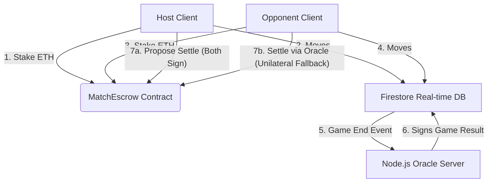

# 👑 PROCHESS: Decentralized Web3 Chess Platform

[](https://opensource.org/licenses/MIT)
[](https://soliditylang.org/)
[](https://react.dev/)
[](https://firebase.google.com/)
[](https://hardhat.org/)

PROCHESS is a real-time multiplayer chess platform combining the speed of serverless architecture (Vite, React, Firebase Firestore) with the trustless security of Web3 (Solidity smart contracts for match escrows, wagers, and cooperative settlements) and a dedicated off-chain Oracle validator.

---

## 🏗️ Architecture Overview

The system is split into three main components:
1.  **Frontend Client (`/client`)**: A Vite + React application. It uses Firestore for real-time, low-latency off-chain moves, `chess.js` for validation, and `ethers.js` for wallet connection and contract interactions.
2.  **Smart Contracts (`/contracts` & `/deploy`)**: Built using Hardhat. The `MatchEscrow.sol` contract holds stakes and pays out winnings/refunds.
3.  **Oracle Server (`/server`)**: A Node.js background service that listens to finished Firestore games, verifies outcomes (checkmate, timeout, draw), generates ECDSA oracle signatures, and uploads them to enable unilateral settlement if an opponent stalls.



---

## 🗺️ Codebase Map & Key Components

*   [MatchEscrow.sol](file:///d:/web3_chess/contracts/MatchEscrow.sol) - Smart contract managing stake escrows, cooperative settlements, draw splitting, and oracle-based overrides.
*   [MatchEscrow.test.js](file:///d:/web3_chess/deploy/test/MatchEscrow.test.js) - Unit test suite covering all contract functions, reverts, payouts, and edge cases.
*   [matchService.js (Client)](file:///d:/web3_chess/client/src/web3/matchService.js) - Frontend Web3 service translating user actions into contract transactions and generating signature payloads.
*   [RoomSetup.jsx](file:///d:/web3_chess/client/src/components/RoomSetup.jsx) - Lobby management component capturing wallet addresses and enforcing the on-chain match wager stakes.
*   [GameInfo.jsx](file:///d:/web3_chess/client/src/components/GameInfo.jsx) - Active stats display showing on-chain status, cancellation refund trigger, and claim payout controls.
*   [GameOverModal.jsx](file:///d:/web3_chess/client/src/components/GameOverModal.jsx) - Consensus modal coordinating end-game results, player signatures, and oracle fallbacks.
*   [index.js (Oracle Server)](file:///d:/web3_chess/server/src/index.js) - Off-chain backend listening to database state changes to generate trusted signature claims.

---

## 🌟 Key Features

*   **⚡ Real-Time Chess**: Powered by `react-chessboard` and `chess.js` with instant move updates synced over real-time Firestore listeners.
*   **🔐 On-Chain Match Escrow**: Trustless wagering on games. Creator stakes ETH to open a match; opponent matches the stake to activate the match.
*   **🤝 Draw/Stalemate Split**: The contract handles decisive results (winner-take-all) and draws (automatic 50/50 stake splits).
*   **✍️ Cooperative Settlement**: Fast-path settlement where both players sign off on the end FEN/winner state and submit it to the contract.
*   **🔮 Oracle Settlement Fallback**: If a player times out, drops connection, or refuses to sign, the Oracle server validates the Firestore state and issues a single-signature certificate enabling the honest player to claim the escrow.
*   **🛡️ Hardened Security**: Firestore security rules restrict read/write access to room participants.

---

## 🚀 Getting Started (Local Development)

Follow these steps to run the entire stack locally:

### Step 1: Firebase Configuration
1.  Enable **Anonymous Sign-In** under Authentication $\rightarrow$ Sign-in method.
2.  Enable **Cloud Firestore Database**.
3.  Deploy the Firestore security rules from [client/firestore.rules](file:///d:/web3_chess/client/firestore.rules).
4.  Copy the web app credentials from your Firebase console settings.

### Step 2: Spin Up Local Blockchain & Deploy Contract
Navigate to the `deploy` folder, install dependencies, spin up the local node, and deploy the contract:
```powershell
# Install hardhat dependencies
cd deploy
npm install

# Start local hardhat node (runs on http://127.0.0.1:8545)
npx hardhat node

# (In a new terminal) Deploy the escrow contract to localhost
npx hardhat run scripts/deploy.js --network localhost
```
*Note: The deploy script will save the ABI and address output directly into `deploy/deployed/MatchEscrow.json`.*

### Step 3: Configure Environment Variables
*   **Client**: Create `client/.env` and paste your Firebase credentials alongside the local contract configuration:
    ```env
    VITE_FIREBASE_API_KEY=your_key
    VITE_FIREBASE_AUTH_DOMAIN=your_auth_domain
    VITE_FIREBASE_PROJECT_ID=your_project_id
    VITE_FIREBASE_STORAGE_BUCKET=your_storage_bucket
    VITE_FIREBASE_MESSAGING_SENDER_ID=your_sender_id
    VITE_FIREBASE_APP_ID=your_app_id

    VITE_CONTRACT_ADDRESS=0x5FbDB2315678afecb367f032d93F642f64180aa3
    VITE_CHAIN_ID=31337
    ```

*   **Server**: Create `server/.env`:
    ```env
    FIREBASE_PROJECT_ID=your_project_id
    RPC_URL=http://127.0.0.1:8545
    DEPLOYER_PRIVATE_KEY=0xac0974bec39a17e36ba4a6b4d238ff944bacb478cbed5efcae784d7bf4f2ff80
    CONTRACT_ADDRESS=0x5FbDB2315678afecb367f032d93F642f64180aa3
    CHAIN_ID=31337
    PORT=4000
    ```

### Step 4: Run the Backend Oracle Server
Navigate to the `server` folder, install dependencies, and start the node process:
```powershell
cd server
npm install
npm start
```

### Step 5: Run the Frontend Client
Navigate to the `client` folder, install dependencies, and start the development server:
```powershell
cd client
npm install
npm run dev
```
Open [http://localhost:5173/](http://localhost:5173/) in your web browser.

---

## 🧪 Local Testing Workflow

To simulate two players staking and playing locally:

### 1. Set Up MetaMask Accounts
1.  Add a custom RPC network in MetaMask pointing to `http://127.0.0.1:8545` (Chain ID `31337`).
2.  Import the first two private keys generated by the Hardhat node console output:
    *   **Host Private Key**: `0xac0974bec39a17e36ba4a6b4d238ff944bacb478cbed5efcae784d7bf4f2ff80`
    *   **Opponent Private Key**: `0x59c6995e998f97a5a0044966f0945389dc9e86dae88c7a8412f4603b6b78690d`

### 2. Play a Staked Match
1.  **Host**: Open [http://localhost:5173/](http://localhost:5173/), connect MetaMask with the **Host Account**, click **Create Game**, and click **CREATE ON-CHAIN MATCH** in the Arena panel. Enter a wager (e.g. `0.01` ETH) and submit.
2.  **Opponent**: Open [http://localhost:5173/](http://localhost:5173/) in an **Incognito Window**, connect MetaMask with the **Opponent Account**, click **Join Game**, enter the room's **Arena ID**, and confirm the transaction to stake a matching `0.01` ETH.
3.  **Play**: Make moves on the board. 
4.  **Cooperative Settle**: Once the game ends in checkmate or a draw, click **SIGN RESULT** on both windows. Then click **PROPOSE ON-CHAIN** to execute the payouts. Click **CLAIM PAYOUT** in the stats panel to withdraw your earnings.
5.  **Oracle Settle**: If one player disconnects mid-game, wait for the oracle server to write the `oracleSignature` to Firestore. The remaining player can then click **SETTLE VIA ORACLE** in the game over modal to claim the winnings unilaterally.

---

## 🛠️ Troubleshooting & Tips

> [!TIP]
> **MetaMask Transaction Nonce Issue**:
> - When running local Hardhat node repeatedly, your MetaMask account nonce might get out of sync causing transactions to stall.
> - **Solution**: Go to MetaMask Settings $\rightarrow$ Advanced $\rightarrow$ **Clear activity tab data** (or "Reset Account") to clear the cached transaction history.

> [!WARNING]
> **Firebase Connection Error**:
> - If you see "Firebase is not configured", double check that your `client/.env` file keys are loaded correctly and prefix with `VITE_`.
> - Check that you have enabled **Anonymous Auth** in your Firebase console.

> [!IMPORTANT]
> **Network Mismatch**:
> - Ensure your wallet is connected to `http://127.0.0.1:8545` (Chain ID `31337`). The smart contract calls will fail if the wallet is on Mainnet or another testnet.
